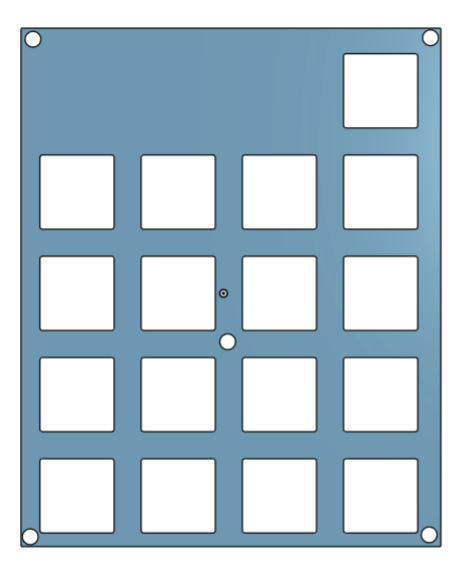

## 1st of June: Hardware!
I followed the tutorial on the official Hackpad website and also understood the matrix wiring concept (which I found pretty cool) in order to draw-up the schematic. Thankfully, both my 4x4 matrix and the EC11 rotary encoder with the momentary push button *just* fit on all of the XIAO RP2040's pins.

The tutorial was quite helpful and apart from getting used to some of KiCad's shortcuts and functions and finding symbols, the schematic didn't take too long.

**Total time spent:** 2.5h

Following the tutorial, I lined up all my switches in the PCB editor, and placed the XIAO RP2040 and EC11 on near the top. I really squeezed everything in, making sure the layout was as compact as possible without much unused space on the outside of the PCB. I also now understood the concept of routing and what it means physically on a PCB - I'll route everything next.

**Total time spent:** 0.5h

## 2nd of June: Still Hardware...
I loaded up my PCB again, but it seemed that I had changed around some of my folders and paths, causing the Electrical Rules Checker in my schematic to throw a bunch of errors about finding symbols and associated footprints. I followed the initial part of Joe Scotto's tutorials on how to design mechanical keyboard PCBs where he went through how to properly import footprint and symbol libraries. With that done, I fixed some other errors on my schematic and replaced some of my previous symbols with those from the ScottoKicad library. The ERC showed no more errors, and my changed schematic looks like this.

I've also finally managed to route up my PCB (after updating it to match the fixed up schematic) - it isn't the most neatly wired, and I had to use some vias, but I managed to get it done. The DRC also shows no errors or warnings, which is a good sign.

**Total time spent:** 3h

## 3rd of June: Designing the case!
As the name of the Hackpad suggests, I want it to mimic the overall look of my Keychron K2. I've drawn up a quick sketch of exactly what I'm after.

My choice of CAD software for this is Onshape as I've used it quite a lot in the past.

I watched Joe Scotto's [video](https://www.youtube.com/watch?v=7azQkSu0m_U&t=405s) on how to design cases for mechanical keyboards and it really dumbed down everything for me. After importing my DXF and making the plate, the bottom of the case was fairly simple to do. Pertaining to my Keychron inspired ideas as shown in the plan above, I added chamfers to each of the main edges and added an angle section at the bottom for better ergonomics.

I've added pictures of the plate and bottom of the case below;

**Total time spent:** 2.5h

I had some more time today, so after spending a lot of time going through QMK docs, I managed to get the firmware written - I've assigned everything from app opening shortcuts and other very-specific-to-me functions to each of the keys. The encoder will be used mainly for volume control.

**Total time spent:** 1h